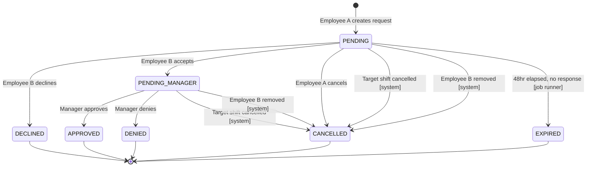

# Feature Spec Master Prompt — Full Example Walkthrough

**Feature:** F-005 — Shift Swap Requests
**Project:** ShiftSync (B2B workforce scheduling SaaS)
**Spec version:** 1.0

---

## What Was Provided to Start

```
[Feature Spec Master Prompt — full contents]

---

PRD: ShiftSync PRD v1.0 (relevant section)
SSOT: ARCHITECTURE.md Section 0
Feature to spec: F-005 — Shift Swap Requests
```

---

## Phase 0 — Question Batches

### Batch 1 of 3 — Actor Flow and Timing

**Feature Spec Prompt asks:**

> Reading F-005 in the PRD. The flow involves three actors in sequence —
> Employee A initiates, Employee B responds, Manager approves. Before speccing
> this I need to resolve some gaps.
>
> **Batch 1 of 3**
>
> 1. When Employee A initiates a swap, they select a co-worker to swap with.
>    Can they select any employee in the location, or only employees who are
>    currently scheduled on the shift they want to swap with? And what happens
>    if the target shift has already been swapped or cancelled by the time
>    Employee B responds?
>
> 2. The PRD says the swap auto-expires after 48 hours if Employee B does not
>    respond. Is this 48 hours from when the request was created, or 48 hours
>    before the earlier of the two shift start times? These produce very
>    different expiry windows.
>
> 3. If a manager approves the swap and then one of the resulting calendar events
>    fails to sync — does the swap still count as approved, or does the whole
>    thing roll back?

**Developer answers:**

> 1. Employee A can select any active employee in the location who shares the
>    same role — they don't have to be scheduled on the target shift. But the
>    target employee must be scheduled on a shift during the period. If the target
>    shift is cancelled before Employee B responds — the swap request auto-cancels
>    and Employee A is notified.
>
> 2. 48 hours from when the request was created. Not tied to shift time.
>    Separate rule: swaps must be initiated at least 24 hours before the earlier
>    shift start. That's a validation at creation time, not an expiry.
>
> 3. Calendar sync failure does not roll back the swap. Swap is approved —
>    schedules update immediately. Calendar sync is a best-effort background job.
>    Employee gets an in-app notification to reconnect their calendar if sync fails.

---

### Batch 2 of 3 — Concurrent Operations and Permissions

**Feature Spec Prompt asks:**

> **Batch 2 of 3**
>
> 4. Race condition: two employees initiate separate swap requests for the same
>    shift at the same time (Employee A swaps with Employee B, Employee A also
>    swaps with Employee C). Should the system allow multiple pending swap
>    requests for the same shift simultaneously, or block a second request while
>    one is already pending?
>
> 5. When the manager approves the swap, both employees' schedules change.
>    What happens to any OTHER pending swap requests that involve either of
>    those shifts — do they auto-cancel since the shifts now have different owners?
>
> 6. Can a manager or owner initiate a swap on behalf of an employee, or is
>    swap initiation strictly an employee-only action?

**Developer answers:**

> 4. Block it. An employee can only have one pending swap request per shift at
>    a time. If they try to create a second one for the same shift while one is
>    pending, return a 409 conflict error.
>
> 5. Yes — when a swap is approved, any other pending swap requests involving
>    either of those two shifts auto-cancel. The affected employees get notified
>    that their swap was cancelled because the shift was reassigned.
>
> 6. Employee-only. Managers approve or deny — they do not initiate.
>    This is important: managers should not be able to move employees around
>    without going through the proper request flow.

---

### Batch 3 of 3 — Notifications and Data

**Feature Spec Prompt asks:**

> **Batch 3 of 3**
>
> 7. Notification content: when the manager approves a swap, both employees
>    are notified. What level of detail goes in the notification — just "your
>    swap was approved" or does it include the shift details (date, time, role)?
>
> 8. The SwapRequest entity needs to store the reason from Employee A. Is the
>    reason visible to the manager during approval, to Employee B during
>    acceptance, or to both?
>
> 9. When an employee is removed from the location mid-flow — say Employee B
>    is removed after they accepted but before the manager approves — what
>    happens to the swap request?

**Developer answers:**

> 7. Full shift details in every notification. "Your shift swap for Saturday
>    6pm–10pm Barista has been approved by James." Not just "swap approved."
>    Employees need enough context to act without opening the app.
>
> 8. Reason is visible to both Employee B (during their accept/decline decision)
>    and the manager (during approval). It's there to help both parties make an
>    informed decision.
>
> 9. If Employee B is removed before manager approval — swap request auto-cancels
>    with reason EMPLOYEE_REMOVED. Employee A is notified. The shift returns to
>    its original state.

---

**Developer types:**

```
Phase 0 complete. Generate the spec.
```

---

---

# FEATURE-SPEC-F-005-shift-swaps.md

---

## Section 1 — Feature Summary

```
Feature ID:    F-005
Feature name:  Shift Swap Requests
Priority:      P0
Sprint:        Sprint 2
Size estimate: L
Spec version:  1.0
Last updated:  2024-02-05
```

Shift Swap Requests allow an employee to propose trading one of their upcoming
shifts with a co-worker's shift. The flow is three-stage: Employee A initiates
the request, Employee B accepts or declines, and a manager gives final approval.
Only after all three steps are complete do the schedules actually change.

This feature exists because the current state — employees coordinating swaps over
WhatsApp with managers confirming separately — creates miscommunication, missed
approvals, and schedule inconsistencies. SwapRequest formalises the entire flow
in one traceable, auditable chain of custody.

---

## Section 2 — Actors and Permissions

| Action | Owner | Manager | Employee | Unauth |
|--------|-------|---------|----------|--------|
| Create swap request | ❌ | ❌ | ✅ (own shifts only) | ❌ |
| View own swap requests | ✅ | ✅ | ✅ (own only) | ❌ |
| View all location swap requests | ✅ | ✅ | ❌ | ❌ |
| Accept / decline as target co-worker | ❌ | ❌ | ✅ (target only) | ❌ |
| Approve / deny as manager | ✅ | ✅ | ❌ | ❌ |
| Cancel own pending request | ❌ | ❌ | ✅ (initiator only) | ❌ |

**Permission violations — expected responses:**

| Who tries what | HTTP | Error code |
|---|---|---|
| Manager tries to create a swap request | 403 | `INSUFFICIENT_PERMISSIONS` |
| Employee tries to approve/deny | 403 | `INSUFFICIENT_PERMISSIONS` |
| Employee B tries to approve/deny (not their request) | 403 | `NOT_REQUEST_PARTICIPANT` |
| Employee tries to view another employee's requests | 403 | `INSUFFICIENT_PERMISSIONS` |
| Unauthenticated user hits any endpoint | 401 | `UNAUTHENTICATED` |

---

## Section 3 — API Contract

All routes require `Authorization: Bearer <token>` and `X-Location-Id: <locationId>`.

---

### POST /api/scheduling/swap-requests
*Create a new swap request*
**Auth:** `requireAuth` + `requireRole('EMPLOYEE')`

```
Request body:
{
  initiatingShiftId: string  // shift ID owned by the requesting employee
  targetUserId:      string  // employee to swap with (must share same role)
  targetShiftId:     string  // target employee's shift to swap with
  reason:            string  // optional, max 300 chars
}

Zod schema: createSwapRequestSchema

Success response (201):
{
  success: true,
  data: {
    id:                string
    initiatingUserId:  string
    targetUserId:      string
    initiatingShiftId: string
    targetShiftId:     string
    status:            "PENDING"
    reason:            string | null
    createdAt:         string  // ISO 8601
    expiresAt:         string  // ISO 8601 — createdAt + 48 hours
  }
}

Error responses:
  400 — VALIDATION_ERROR         — invalid body, missing fields, reason too long
  403 — INSUFFICIENT_PERMISSIONS — non-employee caller
  404 — SHIFT_NOT_FOUND          — initiatingShiftId does not exist in location
  404 — USER_NOT_FOUND           — targetUserId not active in this location
  404 — TARGET_SHIFT_NOT_FOUND   — targetShiftId does not exist in location
  409 — SWAP_ALREADY_PENDING     — a pending swap for initiatingShiftId already exists
  422 — ROLE_MISMATCH            — initiating and target shifts have different roleId
  422 — SHIFT_WINDOW_VIOLATION   — initiating shift starts in less than 24 hours
  422 — SHIFT_NOT_PUBLISHED      — one or both shifts are not in PUBLISHED status
  422 — SELF_SWAP                — targetUserId equals requesting user's id
```

---

### GET /api/scheduling/swap-requests
*List swap requests for the current location*
**Auth:** `requireAuth` + `requireRole('MANAGER')` for all; employees see own only (enforced server-side)

```
Query params:
  status?:  RequestStatus  // filter by status
  userId?:  string         // MANAGER/OWNER only — filter by employee

Success response (200):
{
  success: true,
  data: SwapRequest[],
  meta: { page, pageSize, total }
}
```

---

### PATCH /api/scheduling/swap-requests/:id
*Action on a swap request — accept, decline, approve, deny, or cancel*
**Auth:** `requireAuth` — role validated by action type server-side

```
Request body:
{
  action: "ACCEPT" | "DECLINE" | "APPROVE" | "DENY" | "CANCEL"
  note?:  string  // optional manager note on APPROVE/DENY, max 300 chars
}

Success response (200):
{
  success: true,
  data: SwapRequest  // full updated request
}

Error responses:
  400 — VALIDATION_ERROR          — invalid action or note too long
  403 — INSUFFICIENT_PERMISSIONS  — role not permitted for this action
  403 — NOT_REQUEST_PARTICIPANT   — employee not initiator or target
  404 — SWAP_REQUEST_NOT_FOUND    — request does not exist in this location
  409 — INVALID_STATE_TRANSITION  — action not valid from current status
                                    (e.g. APPROVE on a PENDING request —
                                     must be PENDING_MANAGER first)
  422 — EMPLOYEE_REMOVED          — target employee no longer active
```

---

## Section 4 — State Machine

### Status values

| Status | Meaning |
|--------|---------|
| `PENDING` | Request created. Waiting for Employee B to respond. |
| `DECLINED` | Employee B declined. Terminal state. |
| `PENDING_MANAGER` | Employee B accepted. Waiting for manager approval. |
| `APPROVED` | Manager approved. Schedules have been swapped. Terminal state. |
| `DENIED` | Manager denied. Schedules unchanged. Terminal state. |
| `CANCELLED` | Initiating employee cancelled, or system auto-cancelled. Terminal state. |
| `EXPIRED` | 48 hours elapsed with no response from Employee B. Terminal state. |

### State diagram



### Transition table

| From | To | Trigger | Actor | Condition | Side effects |
|------|----|---------|-------|-----------|--------------|
| — | PENDING | POST /swap-requests | Employee A | Role match, 24hr window, no existing pending | Notify Employee B (push + email) |
| PENDING | PENDING_MANAGER | PATCH action=ACCEPT | Employee B | Request not expired | Notify Manager (push + email) |
| PENDING | DECLINED | PATCH action=DECLINE | Employee B | — | Notify Employee A (push + email) |
| PENDING | CANCELLED | PATCH action=CANCEL | Employee A | — | No notification required |
| PENDING | CANCELLED | Target shift cancelled | System | Shift status → CANCELLED | Notify Employee A (push + email) |
| PENDING | CANCELLED | Employee B removed | System | UserLocation.isActive → false | Notify Employee A (push + email), reason: EMPLOYEE_REMOVED |
| PENDING | EXPIRED | 48hr elapsed | Job runner | expiresAt <= NOW() | Notify Employee A (push + email) |
| PENDING_MANAGER | APPROVED | PATCH action=APPROVE | Manager/Owner | — | Swap shift assignments in DB. Notify both employees (push + email). Queue CALENDAR_SYNC job. Cancel other pending swaps for both shifts. |
| PENDING_MANAGER | DENIED | PATCH action=DENY | Manager/Owner | — | Notify both employees (push + email), include manager note if provided |
| PENDING_MANAGER | CANCELLED | Target shift cancelled | System | Shift status → CANCELLED | Notify Employee A + Manager (push + email) |
| PENDING_MANAGER | CANCELLED | Employee B removed | System | UserLocation.isActive → false | Notify Employee A + Manager (push + email), reason: EMPLOYEE_REMOVED |

---

## Section 5 — Happy Path Flow

```
1. Employee A selects their shift on the schedule view
   → Taps "Request Swap"
   → System shows eligible co-workers (same role, active in location)

2. Employee A selects Employee B and their shift, enters optional reason
   → Taps "Submit Request"
   → System validates: role match ✅, 24hr window ✅, no existing pending ✅
   → SwapRequest created with status PENDING, expiresAt = now + 48 hours
   → Employee B receives push notification:
     "James wants to swap his Saturday 10am–4pm Barista shift with yours.
      Reason: 'Family event.' Open ShiftSync to respond."
   → Employee B receives email with same content
   → Employee A sees request in "My Requests" with status: Pending co-worker response

3. Employee B opens the app, views the request details
   → Sees: Employee A's shift details, their own shift details, reason
   → Taps "Accept"
   → SwapRequest status → PENDING_MANAGER
   → Manager receives push + email:
     "Sofia has accepted James's swap request for Saturday 10am shifts.
      Your approval is needed."
   → Employee A's status updates to: Pending manager approval

4. Manager opens the approval queue, reviews the request
   → Sees: both employees, both shifts, Employee A's reason
   → Checks for any scheduling conflicts or rule violations (warnings shown if any)
   → Taps "Approve"
   → SwapRequest status → APPROVED
   → Shift.assignedUserId swapped in database (both records updated atomically)
   → Employee A receives: "Your swap request was approved by James.
      You're now scheduled for Saturday 10am–4pm."
   → Employee B receives: "Your swap was approved by James.
      You're now scheduled for [Employee A's original shift]."
   → Background job queued: CALENDAR_SYNC for both employees
   → Any other pending swap requests for either shift → auto-CANCELLED
```

---

## Section 6 — Edge Case Table

| # | Scenario | Actor | Precondition | Expected behaviour | HTTP | Error code |
|---|---|---|---|---|---|---|
| E-01 | Employee tries to swap with an employee of a different role | Employee A | Target shift has different roleId | Request rejected at creation | 422 | `ROLE_MISMATCH` |
| E-02 | Shift starts in less than 24 hours | Employee A | initiatingShift.startTime < now + 24h | Request rejected at creation | 422 | `SHIFT_WINDOW_VIOLATION` |
| E-03 | Employee already has a pending swap for the same shift | Employee A | SwapRequest with status PENDING exists for initiatingShiftId | Request rejected | 409 | `SWAP_ALREADY_PENDING` |
| E-04 | Employee tries to swap a shift with themselves | Employee A | targetUserId === req.user.userId | Request rejected | 422 | `SELF_SWAP` |
| E-05 | Employee tries to swap a DRAFT shift | Employee A | Shift.status === DRAFT | Request rejected | 422 | `SHIFT_NOT_PUBLISHED` |
| E-06 | Employee B does not respond in 48 hours | System | expiresAt <= NOW() | Job runner sets status EXPIRED, notifies Employee A | — | — |
| E-07 | Target shift is cancelled while request is PENDING | System | Shift status → CANCELLED | Request auto-CANCELLED, Employee A notified | — | — |
| E-08 | Target shift is cancelled while request is PENDING_MANAGER | System | Shift status → CANCELLED | Request auto-CANCELLED, Employee A + Manager notified | — | — |
| E-09 | Employee B is removed from location while PENDING | System | UserLocation.isActive → false | Request auto-CANCELLED, Employee A notified with reason EMPLOYEE_REMOVED | — | — |
| E-10 | Employee B is removed while PENDING_MANAGER | System | UserLocation.isActive → false | Request auto-CANCELLED, Employee A + Manager notified | — | — |
| E-11 | Two employees create swap requests for the same shift simultaneously | Employee A + Employee C | Both requests submitted within milliseconds | First request succeeds, second returns 409 SWAP_ALREADY_PENDING | 409 | `SWAP_ALREADY_PENDING` |
| E-12 | Manager tries to approve a PENDING request (Employee B hasn't accepted yet) | Manager | Status is still PENDING | Rejected — invalid state transition | 409 | `INVALID_STATE_TRANSITION` |
| E-13 | Employee tries to action swap they are not a participant in | Employee C | Request between A and B | Rejected | 403 | `NOT_REQUEST_PARTICIPANT` |
| E-14 | A swap gets approved — other pending swaps involving either shift exist | System | Other SwapRequests exist for same shifts | All other pending swaps auto-CANCELLED, affected employees notified | — | — |
| E-15 | Manager approves but one calendar sync fails | System | Google OAuth token expired | Swap approved. Calendar sync job marked FAILED after 3 attempts. Employee notified in-app to reconnect calendar. | — | — |
| E-16 | Employee tries to cancel a request that is already PENDING_MANAGER | Employee A | Status is PENDING_MANAGER | Rejected — Employee A can only cancel while PENDING | 409 | `INVALID_STATE_TRANSITION` |

---

## Section 7 — Module Impact Map

| Module | Impact | What changes |
|--------|--------|--------------|
| `scheduling` | **Modified** | New router, controller, service methods, repository queries for SwapRequest entity |
| `notifications` | **Read-only** | Called via its exported service interface — `notificationsService.send()`. No changes to the notifications module itself. |
| `calendar-sync` | **Read-only** | Job queued via `background_jobs` table. Calendar sync module reads the job. No direct call from scheduling module. |

**Cross-module communication rules:**

The `scheduling` module must never import from `notifications` or `calendar-sync`
internal files. Communication happens via:
- Notifications: `import { notificationsService } from '../../notifications/index'`
- Calendar sync: Insert a row into `background_jobs` table with type `CALENDAR_SYNC`

**New methods needed in scheduling module:**

Service layer (`swap-request.service.ts`):
- `createSwapRequest(userId, locationId, body)` → SwapRequest
- `actionSwapRequest(requestId, userId, locationId, action, note?)` → SwapRequest
- `expireStaleRequests()` → number (count of expired — called by job runner)
- `cancelSwapsForShift(shiftId)` → void (called when shift is cancelled)
- `cancelSwapsForRemovedEmployee(userId, locationId)` → void

Repository layer (`swap-request.repository.ts`):
- `create(data)` → SwapRequest
- `findById(id, locationId)` → SwapRequest | null
- `findByLocation(locationId, filters)` → SwapRequest[]
- `findPendingForShift(shiftId)` → SwapRequest[]
- `updateStatus(id, status, extra?)` → SwapRequest
- `findExpired()` → SwapRequest[]

---

## Section 8 — Schema Changes

No new tables. The `SwapRequest` model already exists in the schema from
`ARCHITECTURE.md`. Confirming no changes needed to the existing definition.

**One new index needed:**

```prisma
// Add to SwapRequest model in schema.prisma
@@index([initiatingShiftId, status])
@@index([targetShiftId, status])
@@index([expiresAt, status])  // for job runner expiry query
```

**Reason:**
- `initiatingShiftId + status` — used to check for existing PENDING swaps on creation
- `targetShiftId + status` — used to cancel related swaps when a shift is cancelled
- `expiresAt + status` — used by job runner to find PENDING requests past their expiry

No new shared types needed. All types already defined in SSOT.

---

## Section 9 — Pre-Written Test Cases

### Unit Tests (swap-request.service.ts)

```
TEST: creates swap request successfully with valid inputs
  Given:  valid initiatingShiftId (PUBLISHED, same role as targetShift),
          targetUserId (active, same location), no existing pending swap
  When:   createSwapRequest() called
  Expect: SwapRequest returned with status PENDING,
          expiresAt = createdAt + 48 hours,
          notificationsService.send() called once for Employee B

TEST: rejects swap when role mismatch
  Given:  initiatingShift.roleId !== targetShift.roleId
  When:   createSwapRequest() called
  Expect: throws AppError with code ROLE_MISMATCH

TEST: rejects swap when shift starts in less than 24 hours
  Given:  initiatingShift.startTime = now + 20 hours
  When:   createSwapRequest() called
  Expect: throws AppError with code SHIFT_WINDOW_VIOLATION

TEST: rejects swap when pending swap already exists for shift
  Given:  SwapRequest with status PENDING exists for initiatingShiftId
  When:   createSwapRequest() called
  Expect: throws AppError with code SWAP_ALREADY_PENDING

TEST: ACCEPT transition moves status to PENDING_MANAGER
  Given:  SwapRequest with status PENDING, caller is targetUserId
  When:   actionSwapRequest(id, targetUserId, locationId, 'ACCEPT')
  Expect: status → PENDING_MANAGER,
          manager notification sent

TEST: APPROVE swaps shift assignments atomically
  Given:  SwapRequest with status PENDING_MANAGER
  When:   actionSwapRequest(id, managerId, locationId, 'APPROVE')
  Expect: initiatingShift.assignedUserId === original targetUserId,
          targetShift.assignedUserId === original initiatingUserId,
          both updates in single transaction,
          CALENDAR_SYNC job inserted for both employees,
          both employees notified

TEST: APPROVE cancels other pending swaps for both shifts
  Given:  SwapRequest A-B is PENDING_MANAGER,
          SwapRequest A-C is PENDING for same initiatingShift
  When:   actionSwapRequest approves A-B
  Expect: A-C status → CANCELLED, Employee A notified of cancellation

TEST: expireStaleRequests marks PENDING requests past expiresAt as EXPIRED
  Given:  SwapRequest with status PENDING, expiresAt = 2 hours ago
  When:   expireStaleRequests() called by job runner
  Expect: status → EXPIRED, Employee A notified

TEST: cancelSwapsForRemovedEmployee handles PENDING and PENDING_MANAGER
  Given:  Employee B has one PENDING swap and one PENDING_MANAGER swap
  When:   cancelSwapsForRemovedEmployee(employeeBId, locationId)
  Expect: both → CANCELLED, initiating employees notified for both
```

---

### Integration Tests (API layer — real DB, mocked notifications + calendar)

```
TEST: POST /swap-requests — success
  Setup:   Two published shifts with same roleId, assigned to different employees
  Request: POST /api/scheduling/swap-requests as Employee A with valid body
  Expect:  201, SwapRequest in response with status PENDING
  DB:      SwapRequest row created, expiresAt = createdAt + 48h

TEST: POST /swap-requests — 409 when pending swap exists
  Setup:   Existing PENDING SwapRequest for initiatingShiftId
  Request: POST /api/scheduling/swap-requests for same shift
  Expect:  409, error code SWAP_ALREADY_PENDING

TEST: PATCH /swap-requests/:id — ACCEPT by Employee B
  Setup:   SwapRequest with status PENDING, caller is targetUserId
  Request: PATCH with body { action: "ACCEPT" }
  Expect:  200, status = PENDING_MANAGER in response
  DB:      SwapRequest.status updated to PENDING_MANAGER

TEST: PATCH /swap-requests/:id — ACCEPT by wrong employee (not target)
  Setup:   SwapRequest with status PENDING
  Request: PATCH by Employee C (not participant)
  Expect:  403, error code NOT_REQUEST_PARTICIPANT

TEST: PATCH /swap-requests/:id — APPROVE by manager
  Setup:   SwapRequest with status PENDING_MANAGER
  Request: PATCH as Manager with body { action: "APPROVE" }
  Expect:  200, status = APPROVED
  DB:      Shift A.assignedUserId = Employee B,
           Shift B.assignedUserId = Employee A,
           BackgroundJob CALENDAR_SYNC inserted x2

TEST: PATCH /swap-requests/:id — invalid state transition
  Setup:   SwapRequest with status PENDING (Employee B not yet responded)
  Request: PATCH as Manager with body { action: "APPROVE" }
  Expect:  409, error code INVALID_STATE_TRANSITION
```

---

### E2E Tests (Playwright — full browser flow)

```
TEST: Employee initiates swap → co-worker accepts → manager approves → schedules updated
  As:    Employee A (Sofia), Employee B (James), Manager (Carlos)
  Steps:
    1. Sofia logs in, navigates to My Schedule
    2. Selects her Saturday 10am shift, taps "Request Swap"
    3. Selects James and his Saturday 2pm shift, enters reason, submits
    4. Confirms she sees "Pending co-worker response" in My Requests
    5. James logs in, sees notification badge
    6. Opens swap request, reviews details and reason, taps Accept
    7. Confirms he sees "Pending manager approval"
    8. Carlos logs in as manager, opens Approvals tab
    9. Reviews swap request, sees both shifts and reason, taps Approve
    10. Carlos sees request disappears from approval queue
  Expect:
    - Sofia's schedule shows James's original shift
    - James's schedule shows Sofia's original shift
    - Both receive approval notifications

TEST: Swap expires after 48 hours with no response
  As:    Employee A, background job runner
  Steps:
    1. Employee A creates swap request
    2. Advance mock clock 49 hours
    3. Job runner fires
  Expect:
    - SwapRequest status = EXPIRED
    - Employee A receives expiry notification
    - No schedule changes

TEST: Co-worker declines — initiating employee notified, no schedule change
  As:    Employee A, Employee B
  Steps:
    1. Employee A creates swap request
    2. Employee B opens notification, taps Decline
  Expect:
    - Employee A receives decline notification
    - SwapRequest status = DECLINED
    - Both schedules unchanged
```

---

## Section 10 — Acceptance Criteria

```
[ ] AC-01: Given an employee submits a valid swap request, then a SwapRequest
           is created with status PENDING and the target employee receives
           a push and email notification within 5 minutes containing full
           shift details and the reason.

[ ] AC-02: Given an employee attempts to create a swap request for a shift
           that already has a pending swap, then the response is 409 with
           error code SWAP_ALREADY_PENDING.

[ ] AC-03: Given an employee attempts to swap shifts with a co-worker of a
           different role, then the response is 422 with error code ROLE_MISMATCH.

[ ] AC-04: Given an employee attempts to swap a shift starting in less than
           24 hours, then the response is 422 with SHIFT_WINDOW_VIOLATION.

[ ] AC-05: Given Employee B accepts the swap, then the SwapRequest status
           moves to PENDING_MANAGER and the location's managers receive
           a notification within 5 minutes.

[ ] AC-06: Given Employee B declines the swap, then the SwapRequest status
           moves to DECLINED and Employee A receives a notification.

[ ] AC-07: Given a swap request has been PENDING for 48 hours with no
           co-worker response, when the job runner executes, then the
           status is EXPIRED and Employee A receives a notification.

[ ] AC-08: Given a manager approves a swap, then the shift assignments
           are exchanged atomically (both updates succeed or both fail),
           both employees receive approval notifications with full shift
           details, and a CALENDAR_SYNC background job is queued for
           each employee.

[ ] AC-09: Given a manager approves swap A-B, then all other pending or
           pending_manager swap requests involving either of those shifts
           are automatically CANCELLED and the affected employees notified.

[ ] AC-10: Given a manager denies a swap with an optional note, then both
           employees receive a denial notification including the manager's
           note if one was provided, and both schedules are unchanged.

[ ] AC-11: Given the target shift is cancelled while a swap is PENDING
           or PENDING_MANAGER, then the swap request is automatically
           CANCELLED and Employee A (and manager if PENDING_MANAGER)
           is notified.

[ ] AC-12: Given Employee B is removed from the location while a swap
           is in any active state, then the request is CANCELLED with
           reason EMPLOYEE_REMOVED and relevant participants notified.

[ ] AC-13: Given a non-participant employee attempts to action a swap
           request, then the response is 403 with NOT_REQUEST_PARTICIPANT.

[ ] AC-14: Given a manager attempts to approve a request still in PENDING
           status (Employee B has not yet responded), then the response
           is 409 with INVALID_STATE_TRANSITION.

[ ] AC-15: Given a calendar sync fails after swap approval, then the swap
           remains APPROVED, the schedule is updated, and the affected
           employee receives an in-app notification to reconnect their
           calendar.
```

---

## Section 11 — Out of Scope

```
OUT OF SCOPE — F-005 Shift Swap Requests

  - Multi-shift swaps: swapping more than one shift in a single request.
    Each swap is one shift for one shift only.

  - Manager-initiated swaps: managers reassigning shifts do not go through
    the swap request flow. That is direct shift editing (F-002).

  - Swap request editing: once submitted, a request cannot be edited.
    Employee A must cancel and resubmit.

  - Swap history view beyond current sprint: the requests list shows
    the last 90 days. Archiving older records is out of scope for v1.

  - Partial shift swaps: covering part of a shift is out of scope.
    Full shift-for-full shift only.

  - SMS notifications: push and email only. SMS deferred to v2.
```

---

## Section 12 — Dependencies

| Dependency | Type | Status | Reason needed |
|---|---|---|---|
| F-001 Auth + Multi-tenant | Feature | ✅ Done | requireAuth + requireRole middleware, X-Location-Id header pattern |
| F-002 Schedule Builder | Feature | ✅ Done | Shifts must exist and be in PUBLISHED status before swap requests can reference them |
| F-007 Notifications module | Feature | 🔄 In Progress | notificationsService.send() called on every state transition |
| T-019 Notifications scaffold | Task | ⬜ Not Started | The exported service interface must exist before this can be called |

```
⚠️  PARTIALLY BLOCKED
    F-005 can be scaffolded and the core logic can be built.
    However, full integration testing requires T-019 (notifications scaffold)
    to be complete. Raise as a soft dependency — build swap logic now,
    wire notifications when T-019 is ready.
```

---

*Spec complete. Save as `specs/FEATURE-SPEC-F-005-shift-swaps.md`.*
*Paste alongside SSOT at the start of every TASK MODE session building this feature.*